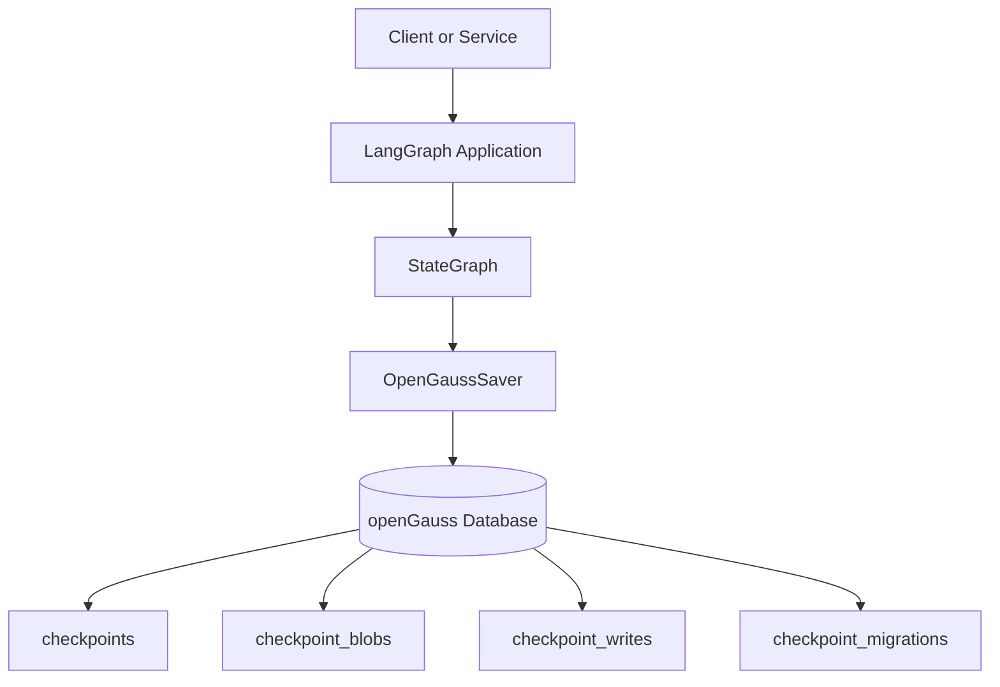

# Running LangGraph with openGauss

## Table of Contents

1. [Overview](#overview)
2. [When to Choose PostgreSQL or openGauss](#when-to-choose-postgresql-or-opengauss)
3. [Target Architecture](#target-architecture)
4. [Install openGauss on Linux](#install-opengauss-on-linux)
5. [Apply a Lightweight Configuration](#apply-a-lightweight-configuration)
6. [Create a LangGraph-Compatible Database](#create-a-langgraph-compatible-database)
7. [How LangGraph Persistence Maps to openGauss](#how-langgraph-persistence-maps-to-opengauss)
8. [Connect LangGraph to openGauss](#connect-langgraph-to-opengauss)
9. [What Problems This Integration Solved](#what-problems-this-integration-solved)
10. [Example Stored Data](#example-stored-data)
11. [Operational Recommendation](#operational-recommendation)
12. [Appendix A: OpenGaussSaver](#appendix-a-opengausssaver)

## Overview

LangGraph applications depend on durable state. Once a graph needs memory, recovery, replay, or long-running execution, the database becomes part of the runtime model rather than just a log sink.

This document shows how to:

- install openGauss on Linux
- prepare an openGauss database for LangGraph persistence
- connect LangGraph to openGauss with a custom saver
- understand what LangGraph stores and why it matters

The guidance in this document is intentionally simple:

- For small deployments, use PostgreSQL.
- For larger deployments, use openGauss.

## When to Choose PostgreSQL or openGauss

Use PostgreSQL when:

- you want the shortest path to production
- you are building a small LangGraph deployment
- you want the default ecosystem path

Use openGauss when:

- you are building for larger platform scale
- your environment already standardizes on openGauss
- you want LangGraph persistence on the same database platform used by the rest of the system

## Target Architecture

### Architecture Diagram



### Architecture Explanation

- The client calls a LangGraph-based application.
- The application runs a `StateGraph`.
- The graph uses `OpenGaussSaver` as its persistence adapter.
- The saver writes durable graph state into openGauss.
- LangGraph state is split across checkpoint tables so the graph can resume, replay, and retain thread memory.

## Install openGauss on Linux

The example below targets Rocky Linux 9.5 x86_64 using the official openGauss RPM repository.

Create the repository definition:

```ini
# /etc/yum.repos.d/opengauss.repo
[opengauss]
name=openGauss
baseurl=https://repo.opengauss.org/yum/redhat/9/opengauss-org/6.0.0/x86_64/
enabled=1
gpgcheck=0
```

Install openGauss:

```bash
dnf install -y opengauss
```

Enable and start the service:

```bash
systemctl enable --now opengauss
systemctl is-enabled opengauss
systemctl is-active opengauss
```

Verify the local installation:

```bash
sudo -u opengauss bash -lc 'source ~/.bash_profile; gsql -d postgres -c "select current_database(), current_user;"'
```

Expected output:

```text
 current_database | current_user
------------------+-------------
 postgres         | opengauss
```

## Apply a Lightweight Configuration

For a development or proof-of-concept environment, a conservative memory profile is sufficient.

Recommended settings:

```conf
shared_buffers = 256MB
max_connections = 50
work_mem = 4MB
maintenance_work_mem = 64MB
autovacuum_max_workers = 2
max_prepared_transactions = 50
```

This keeps resource usage predictable while allowing LangGraph checkpoint operations to run safely on a small host.

## Create a LangGraph-Compatible Database

Create a database in PostgreSQL compatibility mode:

```bash
sudo -u opengauss bash -lc 'source ~/.bash_profile; gsql -d postgres -c "create database langgraph_demo_pg dbcompatibility '\''PG'\'';"'
```

Why this matters:

- LangGraph persistence expects PostgreSQL-like semantics.
- `DBCOMPATIBILITY 'PG'` gives the integration the correct database surface for a LangGraph-oriented saver.

## How LangGraph Persistence Maps to openGauss

LangGraph does not only store final results. It stores execution state.

The persistence layer maps to these openGauss tables:

- `checkpoints`
  Stores checkpoint metadata, lineage, and graph execution progression.
- `checkpoint_blobs`
  Stores serialized state values such as message history.
- `checkpoint_writes`
  Stores intermediate channel writes produced during graph execution.
- `checkpoint_migrations`
  Stores persistence schema version information.

### Why these tables are useful

- `checkpoints` enables recovery and replay.
- `checkpoint_blobs` preserves graph state such as accumulated messages.
- `checkpoint_writes` captures internal graph channel output.
- `checkpoint_migrations` keeps schema evolution manageable.

## Connect LangGraph to openGauss

Once the database is ready, the LangGraph integration point is the custom `OpenGaussSaver`.

### Minimal Example

```python
from langgraph.graph import END, START, MessagesState, StateGraph
from langchain_core.messages import AIMessage, HumanMessage
from langgraph_checkpoint_opengauss import OpenGaussSaver


def assistant_node(state: MessagesState):
    human_messages = [
        message for message in state["messages"] if isinstance(message, HumanMessage)
    ]
    turn = len(human_messages)
    last_human = human_messages[-1].content if human_messages else ""
    return {"messages": [AIMessage(content=f"turn={turn}; echo={last_human}")]}


builder = StateGraph(MessagesState)
builder.add_node("assistant", assistant_node)
builder.add_edge(START, "assistant")
builder.add_edge("assistant", END)

conn_string = (
    "host=127.0.0.1 port=7654 "
    "dbname=langgraph_demo_pg user=opengauss password=YOUR_PASSWORD"
)

with OpenGaussSaver.from_conn_string(conn_string) as saver:
    saver.setup()
    graph = builder.compile(checkpointer=saver)
    result = graph.invoke(
        {"messages": [HumanMessage(content="hello")]},
        config={"configurable": {"thread_id": "demo-thread"}},
    )
    print(result)
```

### Async Example

```python
result = await graph.ainvoke(
    {"messages": [HumanMessage(content="status")]},
    config={"configurable": {"thread_id": "demo-thread"}},
)
```

### What happens during execution

1. LangGraph receives input for a specific `thread_id`.
2. The graph runs one or more node steps.
3. `OpenGaussSaver` persists checkpoints and channel writes.
4. The same `thread_id` can later resume with prior state already loaded from openGauss.

## What Problems This Integration Solved

### 1. Linux installation with a predictable memory profile

The database can be installed directly from the official RPM repository and tuned for local development without large memory overhead.

### 2. A LangGraph-compatible openGauss database layout

A dedicated `PG` compatibility database provides the correct foundation for checkpoint persistence.

### 3. A persistence adapter that matches LangGraph semantics

The custom saver preserves the LangGraph persistence model while allowing openGauss to act as the checkpoint backend.

### 4. Durable thread memory

Repeated invocations on the same `thread_id` recover prior state from openGauss, allowing memory and workflow continuity.

### 5. Recoverable execution state

The checkpoint model allows the graph to resume from persisted state rather than restarting from scratch.

### 6. Sync and async execution support

The same integration model works for both `invoke()` and `ainvoke()` application paths.

## Example Stored Data

After a simple two-turn example, the logical application state looks like this:

```text
Human: hello
AI:    turn=1; echo=hello
Human: status
AI:    turn=2; echo=status
```

That state is persisted through LangGraph checkpoint tables in openGauss.

At a high level:

- `checkpoints` stores step lineage
- `checkpoint_blobs` stores serialized message state
- `checkpoint_writes` stores intermediate writes

This is what makes replay, recovery, and thread memory possible.

## Operational Recommendation

Use this decision rule:

- Small deployment: PostgreSQL
- Large deployment: openGauss

That recommendation keeps the architecture easy to reason about:

- PostgreSQL is the most practical choice for smaller LangGraph systems.
- openGauss is the recommended database direction for larger LangGraph systems.

## Appendix A: OpenGaussSaver

`OpenGaussSaver` is the persistence adapter that connects LangGraph checkpoint semantics to openGauss.

### Responsibility

It provides:

- checkpoint setup
- checkpoint reads
- checkpoint writes
- thread deletion
- sync graph support
- async graph support

### Minimal usage pattern

```python
from langgraph_checkpoint_opengauss import OpenGaussSaver

conn_string = (
    "host=127.0.0.1 port=7654 "
    "dbname=langgraph_demo_pg user=opengauss password=YOUR_PASSWORD"
)

with OpenGaussSaver.from_conn_string(conn_string) as saver:
    saver.setup()
    graph = builder.compile(checkpointer=saver)
```

### Core methods

```python
saver.setup()
saver.get_tuple(config)
saver.list(config, limit=10)
saver.put(config, checkpoint, metadata, new_versions)
saver.put_writes(config, writes, task_id)
saver.delete_thread(thread_id)
```

### Async methods

```python
await saver.aget_tuple(config)
async for item in saver.alist(config, limit=10):
    ...
await saver.aput(config, checkpoint, metadata, new_versions)
await saver.aput_writes(config, writes, task_id)
await saver.adelete_thread(thread_id)
```

With this adapter in place, LangGraph can use openGauss as a durable checkpoint backend while keeping the application-side graph programming model unchanged.
