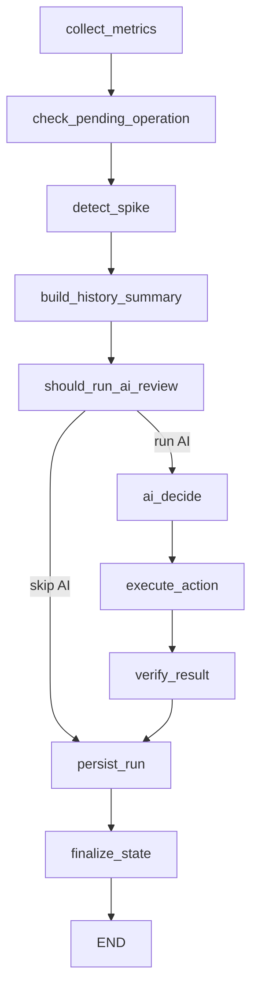

# Building a LangGraph-Based CSS Elasticity AIOps Agent

Project repository: https://github.com/binrogithub/css-elasticity-aiops-agent

## Executive Summary

Cloud Search Service (CSS), or an Elasticsearch/OpenSearch-compatible managed search cluster, is often a critical production dependency. Search clusters are sensitive to workload shape: traffic spikes, shard imbalance, heap pressure, search queue growth, write pressure, and disk usage can all require different operational responses. Traditional threshold-based autoscaling is useful, but it is usually too narrow for search systems because the correct action is not always "add one node". Sometimes the right decision is to add Client nodes, sometimes Data nodes, sometimes dedicated Master nodes, sometimes change a flavor, and sometimes do nothing.

This article explains how to build a production-oriented CSS Elasticity AIOps Agent with LangGraph. The agent periodically collects metrics, detects sudden pressure, summarizes recent history, asks an OpenAI-compatible model for a structured elasticity decision, validates that decision with deterministic safety rules, executes CSS scaling through a provider abstraction, verifies the result, and persists the full operational record.

The system is not a chatbot. It is not a multi-agent demo. It is a stateful operations controller built around one LangGraph workflow and one shared typed state object.

The core design goal is simple:

> Use AI for contextual decision-making, but never let AI bypass deterministic operational safety.

## Why LangGraph Fits This Problem

LangGraph is a good fit when a system needs explicit state transitions, conditional routing, and durable orchestration semantics. CSS elasticity is exactly that type of problem.

A production elasticity workflow must answer questions like:

- What was the current metric snapshot?
- What was the previous snapshot?
- Was this run triggered by a normal schedule or by a spike?
- Is there a pending CSS operation already in progress?
- Is the cluster still in cooldown?
- What did the model recommend?
- Was the recommendation valid?
- Was it blocked by policy?
- Was the CSS action submitted?
- Did verification succeed, fail, or remain pending?
- What state should be carried into the next run?

A simple script can do these things, but the control flow quickly becomes hard to reason about. LangGraph gives us a clean way to model the workflow as a graph of small, explicit nodes. Each node reads and updates a shared state object, and routing decisions are visible in one place.

The result is an auditable control loop rather than a pile of implicit side effects.

## Product Architecture

At a high level, the agent has these subsystems:

- A scheduler that runs the workflow once or continuously.
- A LangGraph workflow that coordinates the operational cycle.
- Metrics providers for Cloud Eye and future metric sources.
- OpenSearch diagnostics for near-real-time search and shard context.
- A spike detector for immediate fast-path AI review.
- A history summarizer for trends and previous actions.
- An OpenAI-compatible AI decision client.
- A deterministic validation and policy layer.
- CSS executors for real scaling and mock execution.
- SQLite persistence for metrics, decisions, actions, verification, state, and scheduler runs.

The architecture intentionally separates responsibilities. Metrics collection does not decide scaling. AI does not execute scaling. The executor does not decide policy. Persistence does not change behavior. This separation makes the system easier to test, extend, and audit.

## The LangGraph Workflow

The workflow is intentionally small and production-oriented:



In code, the graph is built with a `StateGraph` over a typed `AgentState`:

```python
def build_graph(runtime: Runtime):
    graph = StateGraph(AgentState)
    graph.add_node("collect_metrics", collect_metrics_node(runtime))
    graph.add_node("check_pending_operation", check_pending_operation_node(runtime))
    graph.add_node("detect_spike", detect_spike_node(runtime))
    graph.add_node("build_history_summary", build_history_summary_node(runtime))
    graph.add_node("should_run_ai_review", should_run_ai_review_node(runtime))
    graph.add_node("ai_decide", ai_decide_node(runtime))
    graph.add_node("execute_action", execute_action_node(runtime))
    graph.add_node("verify_result", verify_result_node(runtime))
    graph.add_node("persist_run", persist_run_node(runtime))
    graph.add_node("finalize_state", finalize_state_node(runtime))

    graph.set_entry_point("collect_metrics")
    graph.add_edge("collect_metrics", "check_pending_operation")
    graph.add_edge("check_pending_operation", "detect_spike")
    graph.add_edge("detect_spike", "build_history_summary")
    graph.add_edge("build_history_summary", "should_run_ai_review")
    graph.add_conditional_edges(
        "should_run_ai_review",
        route_after_should_run_ai,
        {"ai_decide": "ai_decide", "persist_run": "persist_run"},
    )
    graph.add_edge("ai_decide", "execute_action")
    graph.add_edge("execute_action", "verify_result")
    graph.add_edge("verify_result", "persist_run")
    graph.add_edge("persist_run", "finalize_state")
    graph.add_edge("finalize_state", END)
    return graph.compile()
```

The graph has one conditional branch: whether the AI review should run. If no AI review is needed, the workflow still persists the metric run and finalizes state. This is important because every resource check should be recorded, even when no scaling decision is made.

## Shared State Design

The shared state is a Pydantic model. It is not a loose dictionary. Strong state typing is important because the workflow touches operationally sensitive concepts such as node counts, pending operations, cooldown, AI decisions, and action results.

The state includes:

- Run identity: `run_id`, `now_ts`.
- Cluster identity: `cluster_id`, `cluster_name`.
- Topology: current node count, node-type topology, available flavors, node limits.
- Metrics: current and previous snapshots.
- Diagnostics: OpenSearch health, node, allocation, shard, and search stats.
- Routing: spike detected, spike reason, should run AI.
- Scheduling: last resource check and last AI check time.
- Action memory: last action, last action time, cooldown.
- AI result: raw model response and parsed decision.
- Execution result: action result and verification result.
- Pending operation state.
- Recent history summary.
- Persistence and errors.
- Extensible metadata.

Each graph node updates a small subset of state by returning a patched copy. This keeps state transitions explicit and makes test failures easier to diagnose.

## Runtime Dependency Injection

The workflow nodes are constructed from a `Runtime` dependency container. Runtime contains the settings, providers, repositories, AI client, and executor. This makes nodes deterministic at the orchestration level while still allowing concrete integrations to be swapped:

- Mock metrics provider for local testing.
- CSS/Cloud Eye metrics provider for production.
- Mock executor for safe development.
- CSS executor for real scaling.
- Disabled diagnostics or OpenSearch diagnostics.
- SQLite repositories today, future Postgres repositories later.

This is a practical compromise between simplicity and extensibility. The project does not need a heavy framework, but it still avoids hard-coding concrete cloud integrations inside workflow nodes.

## Scheduling Model

The agent has two logical timers:

- Resource check interval.
- AI review interval.

Resource checks are more frequent. They collect metrics, persist history, and detect spikes. AI reviews are less frequent by default, but a spike can trigger an immediate AI review.

For example:

```env
RESOURCE_CHECK_INTERVAL_SECONDS=300
AI_CHECK_INTERVAL_SECONDS=1800
```

A production cluster may use a five-minute resource check and a thirty-minute AI review. An active elasticity test can use one-minute intervals:

```env
RESOURCE_CHECK_INTERVAL_SECONDS=60
AI_CHECK_INTERVAL_SECONDS=60
```

The scheduler supports two modes:

```bash
python -m app.main --once
python -m app.main --loop
```

`--once` is useful for testing, CI, debugging, and operational dry runs. `--loop` runs continuously with clean signal handling.

## Metrics Collection

The `collect_metrics` node is the first operational node. It gathers three types of context.

First, it collects Cloud Eye metrics through the metrics provider:

- average CPU usage
- average JVM heap usage
- search latency
- search QPS/SearchRate
- search queue
- rejected searches
- disk usage

Second, it collects CSS topology through the executor:

- Data node count and state
- Client node count and state
- Master node count and state
- node names, statuses, IPs, AZs, spec codes
- available resize flavors

Third, it optionally collects OpenSearch diagnostics:

- cluster health
- `_cat/nodes`
- `_cat/allocation`
- `_cat/indices`
- `_cat/shards`
- `_nodes/stats/indices,thread_pool`

The OpenSearch stats path is important in real tests because cloud monitoring can lag behind actual workload. The agent calculates near-real-time search QPS by taking a delta of `query_total` between two OpenSearch samples. It also derives search latency and rejected-search deltas.

This is the key idea:

```text
realtime_qps = (current_query_total - previous_query_total) / elapsed_seconds
```

Then the agent merges the real-time values into the metric snapshot conservatively:

- use the greater of Cloud Eye QPS and OpenSearch real-time QPS
- use the greater of Cloud Eye latency and OpenSearch real-time latency
- use the greater observed queue value
- use rejected-search delta when available

This prevents the AI from missing a real pressure event simply because Cloud Eye has not published the latest point yet.

## Spike Detection

The spike detector is deterministic. It does not call AI. It compares current and previous metrics and checks configured thresholds:

- CPU crossing a threshold
- latency crossing a threshold
- rejected searches appearing or increasing
- QPS jumping by a configured multiplier

A spike sets two state fields:

```text
spike_detected = true
spike_reason = "QPS jumped sharply"
```

Then `should_run_ai_review` routes immediately to AI decision, bypassing the normal AI interval. This creates two paths:

- Normal path: periodic AI review.
- Fast path: spike-triggered immediate AI review.

The fast path is important for query-heavy systems. Queue growth and rejections are often late signals. A sharp QPS jump with low latency can still be valid reason to add Client capacity before user-visible degradation begins.

## History Summary and Business Trend

AI should not receive only one metric point. Single points cause unstable decisions. The `build_history_summary` node constructs a compact operational summary from recent persisted metrics and actions.

The summary includes:

- number of recent samples
- CPU range
- QPS range
- latency range
- max queue
- max rejected searches
- current-versus-previous deltas
- estimated low-load duration
- business growth or decline trend
- recent scaling action history

The business trend summary estimates direction and rate of change:

```text
Business trend window=10.0 minutes,
direction=growth,
qps_start=100.0,
qps_end=900.0,
qps_delta=800.0,
qps_change_pct=800.0,
qps_delta_per_minute=80.0
```

This is essential for multi-node decisions. The code should not hard-code "add one node" or "remove one node". Instead, the AI receives trend, current topology, expected operation duration, node limits, and historical action effectiveness. The model can then return `delta > 1` when one-by-one scaling would be too slow.

The application still enforces safety boundaries after AI decides.

## AI Decision Contract

The AI client uses an OpenAI-compatible API. The model is instructed to return strict JSON only:

```json
{
  "decision": "scale_out",
  "node_type": "ess-client",
  "delta": 2,
  "target_flavor_id": null,
  "reason": "QPS increased sharply while data-node CPU, heap, and disk are not saturated. Add two Client nodes to absorb coordination pressure.",
  "cooldown_minutes": 30,
  "expected_duration_minutes": 30
}
```

Supported decisions are:

- `scale_out`
- `scale_in`
- `change_flavor`
- `hold`

Supported node types are:

- `ess` for Data nodes
- `ess-client` for Client/coordinating nodes
- `ess-master` for dedicated Master nodes

The AI receives:

- current metrics
- previous metrics
- recent history summary
- full node-type topology
- node limits
- available resize flavors
- OpenSearch capacity analysis
- OpenSearch real-time search summary
- business growth/decline trend
- recent scaling action history
- cooldown status
- pending operation state
- traffic entry mode
- Client scale-in safety flag
- estimated low-load minutes
- configured low-load threshold
- expected CSS operation durations
- spike detection result

This prompt design pushes the model toward contextual decisions. It can distinguish:

- Query coordination pressure: scale Client nodes.
- Data-plane pressure: scale Data nodes.
- Cluster coordination risk: scale Master nodes.
- Sustained low load: scale in surplus Client nodes if traffic entry is safe.
- Unsafe or unclear evidence: hold.

## Robust AI Parsing

The model response is not trusted blindly. The parser handles common issues such as markdown code fences or extra text, extracts JSON, validates fields, and falls back to `hold` on malformed output.

Validation rules include:

- decision must be one of the allowed actions
- node type must be valid for non-hold actions
- delta must be a non-negative integer
- missing or malformed fields cause a safe hold
- raw AI response is persisted separately from parsed decision

This gives operators two audit views:

- what the model actually returned
- what the application accepted as the parsed decision

## Why AI Does Not Execute Actions Directly

AI only recommends. It never directly executes CSS operations.

The `execute_action` node first converts the AI decision into an `ActionRequest` through deterministic validation. Then the policy engine decides whether execution is allowed. Only after that does the executor submit a CSS action.

This layered control is critical:

```text
AI decision
  -> schema validation
  -> node limit validation
  -> cooldown validation
  -> traffic-entry validation
  -> data-node safety validation
  -> enterprise policy validation
  -> mutation guard validation
  -> CSS executor
```

This means the AI can say `scale_in ess-client delta=2`, but the application can still convert it to `hold` if traffic entry is direct node IP instead of a load balancer.

It also means the AI can say `scale_in ess delta=3`, but the application can clamp or block it because Data node scale-in can trigger shard relocation and CSS may reject shrink batches that remove too many Data nodes at once.

## Deterministic Safety Rules

The validation and policy layers enforce several safety rules.

Node boundaries:

- never scale below configured minimum
- never scale above configured maximum
- Master nodes must remain in valid allowed counts
- Data node shrink is clamped to avoid removing half or more of current Data nodes in one operation

Cooldown:

- if cooldown is active, scaling becomes hold
- cooldown can vary by action and node type

Pending operation:

- if a CSS scaling operation is still pending, AI actions are skipped
- the agent continues metrics collection and verification while pending
- this prevents duplicate scale-out or scale-in during long CSS provisioning

Traffic entry safety:

- Client nodes do not store shards, but they may be application endpoints
- Client scale-in is blocked unless traffic entry is explicitly configured as load-balanced and Client scale-in is allowed

Data node safety:

- Data scale-in is blocked by default
- capacity analysis can block data scale-in when shard size, shard skew, storage skew, or oversharding risk is detected

Run mode and mutation guard:

- `observe-only`: collect and persist
- `recommend-only`: run AI and validation, but do not mutate CSS
- `approval-required`: require explicit approval
- `auto-execute`: allow CSS mutation only when `CSS_MUTATION_ENABLED=true`

The default posture is safe: recommendation-only and mutation-disabled.

## CSS Executor Abstraction

The executor interface hides the difference between mock execution and real CSS mutation.

A mock executor is useful for local development and tests. A real CSS executor handles:

- reading current topology
- querying resize flavors
- adding Data, Client, or Master nodes
- shrinking supported node types
- changing node-type flavor
- verifying target node count and node stability

CSS operations are asynchronous. Submitting a request is not the same as completion. New nodes may appear in topology before they become stable. The executor returns an action result, and verification can return:

- `success`
- `pending`
- `failed`

When verification is pending, the action is stored as pending state. Future scheduler cycles continue to check it. AI review is skipped until the pending operation completes.

This design is one of the most important production hardening points. Without it, the agent can repeatedly observe pressure while the first scale-out is still provisioning and accidentally submit duplicate scale-out actions.

## Verification Strategy

Verification checks both count and stability.

For example, after scaling Client nodes from 1 to 3, the topology may show three Client nodes quickly, but two new nodes may still be in a provisioning status. The agent should not treat the operation as complete until stable count equals expected count and target nodes are healthy.

The workflow supports non-blocking verification by default:

1. Submit CSS action.
2. Probe once.
3. If pending, persist pending operation.
4. Continue future resource checks.
5. Re-check pending operation in later cycles.
6. Clear pending state only when verification succeeds or fails definitively.

Blocking verification is useful for manual validation, but it is not ideal for a continuously running controller because CSS scaling can take many minutes.

## Persistence and Auditability

All operational history is preserved in SQLite. The core tables are:

- `metrics_snapshots`
- `ai_decisions`
- `actions`
- `action_events`
- `verifications`
- `agent_state`
- `scheduler_runs`

Persisting every stage is not optional for an AIOps controller. Operators need to know why a decision happened, what data was used, what the model returned, what validation did, what action was submitted, and whether the cluster actually reached the expected state.

A typical audit chain looks like this:

```text
metrics snapshot
  -> spike result
  -> history summary
  -> raw AI response
  -> parsed AI decision
  -> validated action request
  -> policy decision
  -> CSS action result
  -> verification result
  -> updated persistent state
```

The database is local in the initial version, but the repository abstraction allows a future Postgres backend without rewriting workflow logic.

## Observability

The agent uses structured logging for lifecycle events:

- runtime initialization
- scheduler ticks
- metrics collection
- spike detection
- AI review routing
- raw AI response
- parsed AI decision
- action validation
- policy decision
- CSS execution
- verification
- persistence
- errors and fallbacks

Every workflow run has a `run_id`, which acts as a correlation key across logs and database records.

In production, these logs can be forwarded to an external log system. The important point is that the agent already emits operationally meaningful events at the right boundaries.

## Handling Multi-Node Scaling

A key lesson from real elasticity work is that one-by-one scaling is often too slow. If traffic grows faster than CSS can provision one node, the controller must be able to request multiple nodes in one action.

This implementation deliberately avoids hard-coding expansion quantity in the application. Instead, the AI is given enough context to choose the delta:

- recent QPS growth or decline
- current QPS and latency
- queue and rejected-search signals
- node limits
- current node count
- expected scaling duration
- recent scaling history
- pending operation status
- cooldown status

The application then validates the AI delta. A max-delta cap can be configured as a safety guard, but it does not raise the AI delta. If AI returns 1, the application does not silently turn it into 5. If AI returns 10 and the configured max delta is 5, the application caps it at 5.

This separation keeps intelligence in the decision layer and safety in the execution layer.

## Client, Data, and Master Node Decisions

Search clusters have different node roles. The model prompt and validation rules reflect that.

Client nodes:

- best target for query coordination pressure
- useful when QPS, search latency, queue, or rejected searches rise while Data nodes are not saturated
- safer to scale out automatically
- scale-in requires load balancer or traffic drain safety

Data nodes:

- best target for storage pressure, shard pressure, write pressure, high heap, high CPU, or disk usage
- scale-out can trigger shard rebalance
- scale-in may trigger shard relocation and affect latency
- scale-in should be conservative and often approval-gated

Master nodes:

- used for cluster coordination and cluster-state stability
- should follow valid stable counts such as 3, 5, or 7
- not a response to ordinary query latency
- changes should usually be approval-required

This role-aware design is what makes the product a CSS AIOps agent rather than a generic CPU autoscaler.

## Capacity Governance With OpenSearch Diagnostics

Cloud metrics are not enough for safe search-cluster operations. A cluster can have low CPU but still be unsafe to shrink because shards are too large, skewed, or numerous.

The OpenSearch diagnostics provider collects shard and node context. The capacity analyzer derives:

- average primary shard size
- max primary shard size
- total shards
- primary shard count
- max shards per node
- average shards per node
- shard skew ratio
- storage skew ratio
- shards per GiB heap

It can flag:

- large shard risk
- small shard or oversharding risk
- storage skew risk
- shard skew risk

If data scale-in is risky, the policy layer blocks it even if AI recommends it. This is a good example of the product philosophy: AI can reason, but deterministic safety wins.

## Configuration Model

Configuration is externalized through environment variables. This makes the same code usable in local tests, staging, and production.

Important groups include:

- AI provider: base URL, API key, model
- scheduler: resource check and AI review intervals
- spike thresholds
- node limits
- CSS/CES credentials and endpoints
- OpenSearch diagnostics settings
- SQLite path
- log directory and format
- run mode and mutation guard
- cooldown values
- data scale-in and Client scale-in safety flags
- enterprise policy settings

A sanitized `.env.example` is included. Real secrets should never be committed.

## Test Strategy

The test suite focuses on critical control-plane logic:

- AI response parsing
- spike detection
- action bounds enforcement
- Client scale-in safety
- Data scale-in blocking
- cooldown and policy behavior
- persistence basics
- state routing
- OpenSearch real-time metric merging
- history and trend summary

These tests are intentionally practical. The goal is not to mock every cloud SDK call. The goal is to protect the decision and safety logic that must not regress.

## Example Operational Flow: Scale Out

A typical scale-out sequence looks like this:

1. Scheduler starts a resource check.
2. `collect_metrics` gathers Cloud Eye metrics, CSS topology, and OpenSearch diagnostics.
3. OpenSearch real-time stats detect a large QPS increase before Cloud Eye catches up.
4. `detect_spike` marks a QPS spike.
5. `build_history_summary` summarizes QPS growth and recent actions.
6. `should_run_ai_review` routes to AI immediately because a spike was detected.
7. `ai_decide` returns `scale_out ess-client delta=2`.
8. Validation confirms the node type, delta, max node limit, cooldown, and pending-operation state.
9. Policy confirms mutation is allowed.
10. CSS executor submits the scale-out action.
11. Verification sees the operation is pending.
12. Pending operation is persisted.
13. Later cycles keep checking until new Client nodes are stable.
14. Pending state is cleared after verification succeeds.

This flow allows proactive scaling while still preventing duplicate submissions during the long CSS provisioning window.

## Example Operational Flow: Scale In

A typical Client scale-in sequence looks like this:

1. Traffic returns to baseline after a spike.
2. Metrics remain low across the configured low-load window.
3. Client node count is above the configured minimum.
4. Traffic entry mode is confirmed as load-balanced.
5. No pending operation exists.
6. Cooldown has expired.
7. Recent action history shows the surplus nodes were added for a transient spike.
8. AI returns `scale_in ess-client delta=2`.
9. Validation confirms scale-in is safe and will not go below minimum.
10. Policy allows the action.
11. CSS executor submits shrink.
12. Verification waits until the topology returns to the target count.

The agent does not remove Data nodes just because CPU is low. Data scale-in has different risk and requires capacity checks.

## Production Hardening Lessons

Several practical lessons shape the design.

First, metric latency matters. Cloud monitoring systems often publish delayed points. For search pressure, OpenSearch real-time stats can close the gap.

Second, provisioning takes time. The system must track pending operations and avoid duplicate scale actions while CSS is still changing topology.

Third, node role matters. Client, Data, and Master nodes solve different problems and carry different risks.

Fourth, scale-in is more dangerous than scale-out. Removing capacity requires evidence of sustained low load, safe traffic entry, and no pending operations.

Fifth, AI needs context, not just thresholds. Business trend, operation duration, historical actions, and topology are necessary for good delta sizing.

Sixth, safety must be deterministic. AI output is an input to validation, not a replacement for validation.

## Future Enhancements

The architecture is intentionally ready for future growth:

- Postgres persistence backend
- external notification hooks
- human approval workflow
- CSS task polling integration
- richer workload forecasting
- per-index or per-tenant signal analysis
- load balancer drain integration
- anomaly detection beyond threshold spikes
- SLO-aware scaling policies
- multi-cluster fleet view
- stronger migration planning for Data node scale-in

These can be added without changing the central LangGraph pattern.

## Conclusion

A CSS elasticity controller needs more than thresholds. It needs state, context, safety, auditability, and role-aware decisions. LangGraph provides a clean orchestration layer for this type of system because it makes each operational step explicit and keeps shared state visible.

The resulting product architecture is simple but robust:

- deterministic metric collection and spike detection
- AI-based contextual elasticity review
- strict JSON decision contract
- deterministic validation and policy enforcement
- real CSS executor behind an abstraction
- non-blocking verification for long-running operations
- durable operational history

This pattern is broadly useful for AIOps systems: let AI reason over rich context, but keep execution safe, typed, auditable, and deterministic.
